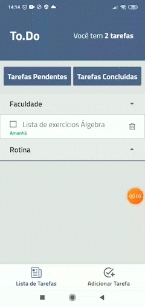

<h1 align="center">TODO-LIST-MOBILE</h1>

<p align="left">Aplicação com o intuito de ajudar pessoas a organizar suas tarefas diarias de forma simples e objetiva, evitando funcionalidades desnecessarias. Aplicação desenvolvida com React Native.</p>

---

<br>


<h1 align="center">
  
  
  

</h1>


## Demonstração :rocket: 

[Download na Play store](https://play.google.com/store/apps/details?id=com.cleberwacheski.TodoList)

## Tecnologias :hammer_and_pick:

As seguintes ferramentas foram usadas na construção do projeto:

- [x] [JavaScript](https://developer.mozilla.org/pt-BR/docs/Web/JavaScript)
- [x] [React Native](https://reactnative.dev/)
- [x] [Context API](https://pt-br.reactjs.org/docs/context.html)
- [x] [React Navigation](https://reactnavigation.org/)
- [x] [React Native Vector Icons](https://github.com/oblador/react-native-vector-icons)
- [x] [Yup](https://github.com/jquense/yup)
- [x] [Styled Components](https://styled-components.com/)
- [x] [EXPO](https://expo.dev/) <br/>
- [x] [UUID](https://www.npmjs.com/package/uuid) <br/>
- [x] [Resposive-font-size](https://www.npmjs.com/package/react-native-responsive-fontsize) <br/>
- [x] [React-native-calendars](https://github.com/wix/react-native-calendars) <br/>
- [x] [Lottie-react-native](https://github.com/lottie-react-native/lottie-react-native) <br/> 
- [x] [Date-fns](https://date-fns.org/) <br/>
- [x] [Async-storage](https://reactnative.dev/docs/asyncstorage)<br/>


## Pré-requisitos

Antes de começar, você vai precisar ter instalado em sua máquina as seguintes ferramentas:
[Expo](https://expo.dev/), [Node.js](https://nodejs.org/en/).

Você também vai precisar configurar o ambiente para desenvolvimento mobile no seu PC: [Configurando Ambiente React Native](https://react-native.rocketseat.dev/).

Além disto é bom ter um editor para trabalhar com o código como [VSCode](https://code.visualstudio.com/)


## Rodando o App

```bash
# Clone este repositório
$ git clone https://github.com/CleberWacheski/Todo-List-Mobile
# Acesse a pasta do projeto no terminal/cmd
$ cd Todo-List-Mobile
# Instale as dependências
$ npm install 
# Inicie o expo
$ expo start
```


